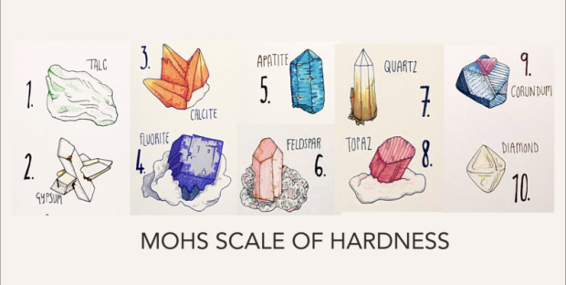

<h1 align="center">Prediction of Mohs Hardness</h1>

<div align="center">

[](https://www.python.org)
[](https://scikit-learn.org/stable/index.html)


[]()
[](https://aws.amazon.com/)

</div>

<h4 align="center">An end to end approach to machine learning</h4>

<strong><p align="center">"Dinosaurs that failed to adapt went extinct. The same thing will happen to data scientists who think that training ML models inside Jupyter notebooks is enough." - Pau Labarta Bajo.</p></strong>

<br />

You can view the live demo of the web app <a href="">here</a>


<h2>Table of Contents</h2>

- [Overview](#overview)
- [Objective](#objective)
- [Mohs Hardness and What it's all about](#mohs_hardness)
- [Dataset](#data)
- [Additional Info](#additional_info)
- [Running Locally](#running_locally)


<a id="overview"></a>
<h2>Overview</h2>
<p align="justify">
Hey guys! It's my first MLOps project - a comprehensive showcase of end-to-end machine learning that seamlessly integrates various real-world components including robust data ingestion, validation, and an efficient data cleaning and transformation pipeline. While completing this project, I aimed not just to showcase machine learning prowess but also to demonstrate effective OOP practices. In addition, I have followed an automated and scalable approach and also ensured modularity.
</p>


<a id="objective"></a>
<h2>Objective</h2>
<p align="justify">
Almost all of my past ML projects were done locally inside a Jupyter notebook with only a handful incorporating tools such as APIs and Streamlit deployment. Moving on, my primary objective is to provide a holistic demonstration of machine learning operations (MLOps) and object-oriented programming (OOP) practices while leveraging tools like MLflow for experiment tracking, and seamlessly integrating continuous integration and continuous deployment (CI/CD) pipelines and so on. I will progressively integrate tools like GitHub Actions as I advance, fostering a collaborative and efficient development environment. Thus far have I come!
</p>


<a id="mohs_hardness"></a>
<h2>Mohs Hardness and What it's all about</h2>
<p align="justify">
The Mohs scale of mineral hardness is a qualitative ordinal scale, from 1 to 10, characterizing the scratch resistance of minerals through the ability of harder material to scratch softer material. - <a href="https://en.wikipedia.org/wiki/Mohs_scale">Wikipedia</a>. <br>
</p>

 <br />

<p align="justify">
The motivation behind this project is to predict the Mohs hardness of minerals of different chemical spaces, crystal structures, and crystal classes. If you would like to have an in-depth understanding of the project source idea, kindly refer <a href="https://data.mendeley.com/datasets/jm79zfps6b/1">here</a>.
</p>


<a id="data"></a>
<h2>Dataset</h2>
<p align="justify">
The datasets used in this repository were obtained from an active (at the time of completing this project) competition on Kaggle. My notebook for the competition which includes training and evaluation is available publicly on <a href="https://www.kaggle.com/code/oyebamijimicheal/mohs-hardness-eda-fe-optuna">the platform</a>.
</p>


<a id="additional_info"></a>
<h2>Additional Info</h2>
<p align="justify">
This project was implemented using the simplest techniques. Hence, you should not expect to see things like cross-validation, extensive feature engineering, hyperparameter tuning, feature selection, and so on. It is worth mentioning that an additional endpoint, <strong>'/train'</strong>, was included. The purpose of this endpoint is basically to initiate the training pipeline and retrain the model from scratch.
</p>


<a id="running_locally"></a>
<h2>Running Locally</h2>
<p align="justify">

### STEP 00 - Clone the repository

```bash
git clone https://github.com/Oyebamiji-Micheal/Prediction-of-Mohs-Hardness
```

### STEP 01 - Create a virtual environment 

**Windows** (cmd) <br>

```bash
cd Prediction-of-Mohs-Hardness
pip install virtualenv
python -m virtualenv venv
```

or

```bash
python3 -m venv venv
```

**macOS/Linux** <br>

```bash
cd Result-Management-System-with-Python-Flask-and-MySQL
pip install virtualenv
python -m virtualenv venv
```

### STEP 02 - Activate environment <br>

**Windows** (cmd)

```bash
venv\scripts\activate
```

**macOS/Linux**

```bash
. venv/bin/activate
```

or

```bash
source venv/bin/activate
```

### STEP 03 - Install the Requirements

Windows/macOS/Linux <br>

```bash
pip install -r requirements.txt
```


### STEP 04 - Run app.py

```bash
python app.py
```

Now,

```bash
Open the url: http://127.0.0.1:8080/ 
```

<br />

